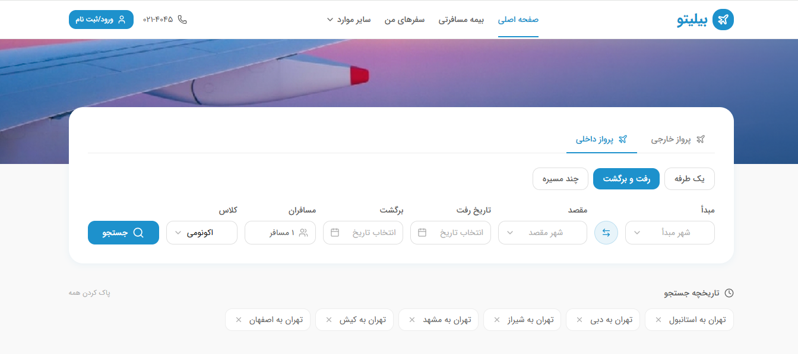
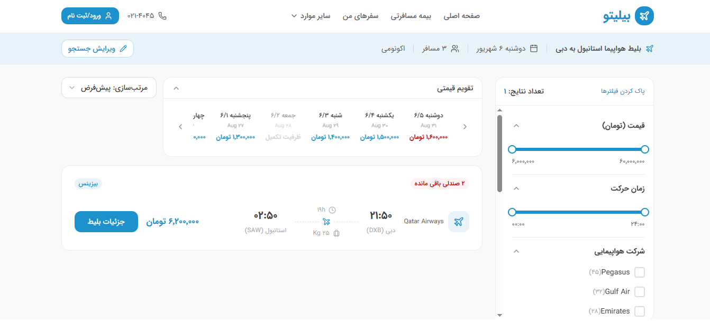
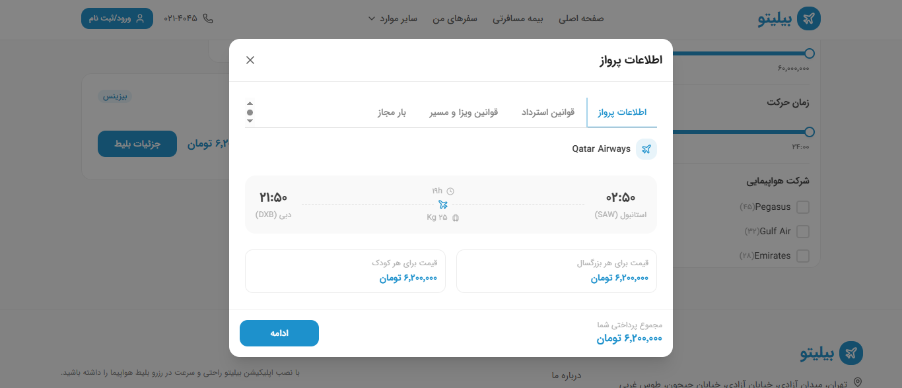
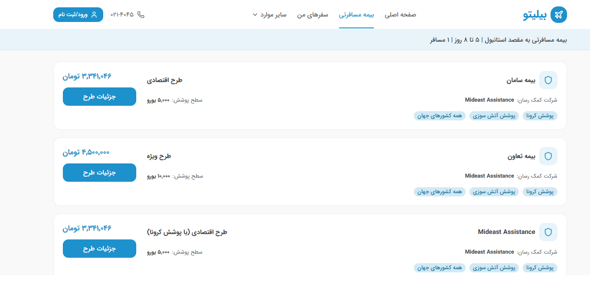
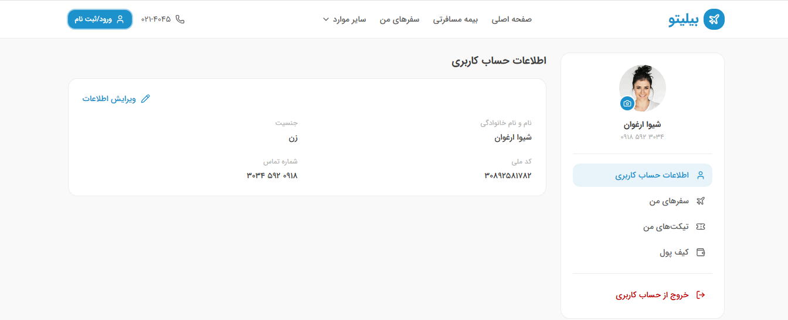
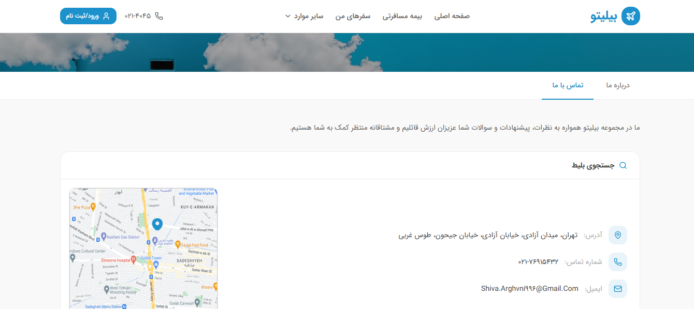

# 🛫 Bilito

> Online flight booking and travel insurance website

[](https://bilito-ten.vercel.app/)
[](https://react.dev/)
[](https://www.typescriptlang.org/)
[](https://tailwindcss.com/)
[](https://vitejs.dev/)

## 📋 About the Project

**Bilito** is a fully-featured flight booking and travel insurance website built with **React 19**, **TypeScript**, and **Tailwind CSS v4**. The project includes flight search, ticket booking, travel insurance purchase, a user dashboard, and auxiliary pages.

🔗 **Live Demo:** [https://bilito-ten.vercel.app](https://bilito-ten.vercel.app/)

## ✨ Features

### ✈️ Flight Section
- Flight search (international and domestic)
- Trip type selection (one-way, round-trip, multi-city)
- Advanced filters (price, time, airline, stops, airport)
- Price calendar and sorting
- Flight cards with complete details
- Flight info modal (4 tabs: Info, Refund Rules, Visa, Baggage)
- Search history

### 🛡️ Insurance Section
- Travel insurance search
- Multiple insurance plans
- Coverage comparison
- Multi-step purchase flow

### 👤 User Panel
- Account information
- Profile editing
- My trips (with full details)
- Support tickets
- Wallet and balance recharge

### 🎨 Auxiliary Pages
- Contact Us (form + map)
- About Us
- Booking Guide (6 steps)
- 404 Page

## 🖼️ Screenshots

### Home Page


### Search Results


### Flight Info Modal


### Travel Insurance


### User Panel


### Contact Us


## 🛠️ Tech Stack

### Frontend
- **React 19** — UI Library
- **TypeScript 5** — Static typing
- **Vite 8** — Blazing fast build tool
- **Tailwind CSS v4** — Styling
- **React Router 8** — Routing

### State Management & Data
- **TanStack Query (React Query)** — API calls management
- **Zustand** — Global state management

### Forms & Validation
- **React Hook Form** — Form management
- **Zod** — Validation

### UI & Icons
- **Lucide React** — Icons
- **React Icons** — Social media icons
- **clsx** — Conditional class management

### Development Tools
- **MSW (Mock Service Worker)** — API mocking
- **ESLint** — Linting

### Persian Utilities
- **jalaali-js** — Jalali/Gregorian date conversion
- **IRANSansX** — Persian font

## 📁 Project Structure

bilito/
├── public/
│ ├── fonts/ # IRANSansX font
│ ├── avatars/ # Profile images
│ ├── destinations/ # Destination images
│ └── flights/ # Flight images
│
├── src/
│ ├── app/
│ │ └── router/ # Router configuration
│ │
│ ├── features/ # Feature-Based Architecture
│ │ ├── home/ # Home page
│ │ ├── flights/ # Flights
│ │ ├── insurance/ # Insurance
│ │ ├── user/ # User panel
│ │ └── contact/ # Contact, About, Guide, 404
│ │
│ ├── shared/
│ │ ├── components/
│ │ │ ├── ui/ # 18 UI components
│ │ │ └── layout/ # Header, Footer, Layout
│ │ ├── lib/ # axios, queryClient, ...
│ │ ├── hooks/ # Shared hooks
│ │ ├── types/ # Shared types
│ │ └── utils/ # Utility functions
│ │
│ ├── mocks/ # MSW handlers
│ ├── index.css # Main stylesheet + Design Tokens
│ └── main.tsx # Entry point
│
├── docs/
│ └── screenshots/ # README screenshots
│
├── index.html
├── package.json
├── tsconfig.json
├── vite.config.ts
└── vercel.json # Deploy configuration


## 🚀 Getting Started

### Prerequisites
- Node.js version 20 or higher
- npm or yarn

### Installation

```bash
# Clone the repository
git clone https://github.com/mohammad11jj/bilito.git
cd bilito

# Install dependencies
npm install

# Run development server
npm run dev

The app will run on http://localhost:5173.

Build for Production

npm run build
npm run preview

🎨 Design System
The project features a custom Design System based on a Figma file:

Primary color: #1D91CC

Full color palette: 5 Tints + 5 Shades + 9 Grays

Font: IRANSansX (9 weights)

Spacing: Based on standard Tailwind scale

Shadows: 6 levels

Border Radius: From 8px to 24px

🧩 UI Components
The project includes 18 reusable components:

Button, Input, Textarea, Select

Checkbox, Radio

Modal, Badge, Card

Stepper, Tabs, Accordion

Alert, Pagination, Skeleton

EmptyState, Container

🔮 Future Improvements
□ Backend integration (ASP.NET Core)
□ OTP authentication
□ Online payment
□ Dark Mode
□ Unit tests with Vitest
□ Storybook for components
□ Code splitting for optimization
👨‍💻 Developer
Mohammad

GitHub: @mohammad11jj

📄 License
This project was built as a portfolio piece and is free to use for educational purposes.

⭐ If you found this project useful, please give it a star!